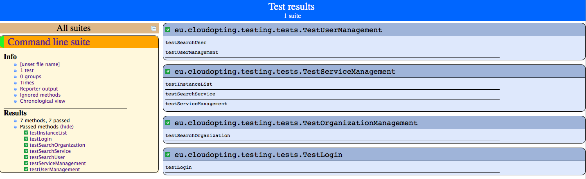

# CloudOpting tests

The test can be run invoking this maven goal:

`mvn clean verify`

At the end of the execution the results are exported in the `/target` directory.  

A sample of the result is available in the `report-example` directory.

Based on [Selenium-Maven-Template](https://github.com/Ardesco/Selenium-Maven-Template).